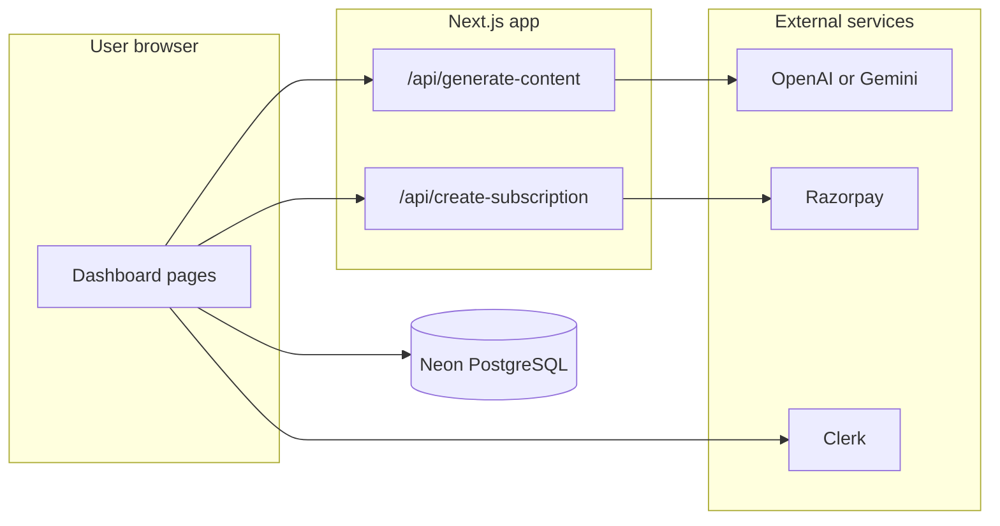

# AI Content Generator — Project Guide

This document explains **what this application is**, **how the pieces fit together**, and **where to look in the code** when you take over the project. It is written so both **non-technical readers** (product, support, new teammates) and **developers** can follow along.

---

## 1. In plain language: what is this?

**AI Content Generator** is a web app where people can:

1. **Sign in** with an account.
2. **Pick a template** (for example: blog titles, YouTube descriptions, social posts).
3. **Fill in a short form** (topic, outline, keywords, and so on).
4. **Click “Generate”** and get **AI-written text** back, shown in a rich editor-style area.
5. **See past generations** in a **History** page.
6. **Optionally subscribe** via **Razorpay** (payment) for billing-related flows.

The “brain” that writes the text is either **OpenAI (ChatGPT-style API)** or **Google Gemini**, depending on which API keys you configure on the server. The browser **does not** hold the secret AI keys; it asks **your server** to run the generation.

---

## 2. Big picture: how the app is organized

Think of the app in four layers:

| Layer | Role | In this project |
|--------|------|------------------|
| **Pages & UI** | What the user sees and clicks | Next.js `app/` folder (React components) |
| **API (server)** | Secret keys, talking to AI and payment APIs | `app/api/` routes |
| **Data** | Saving history and subscription records | Neon (PostgreSQL) + Drizzle ORM |
| **Identity** | Who is logged in | Clerk |

*(History and “save after generate” use the database from the app; the AI route only returns text.)*

*(Some screens also talk to the database directly from client code; see [Section 8](#8-database-what-is-stored).)*

---

## 3. Tech stack (simple definitions)

- **Next.js 15** — Framework that runs both the website and small server endpoints (“API routes”) in one project.
- **React 19** — UI library for building screens out of components.
- **TypeScript** — JavaScript with types; used in many files for fewer mistakes.
- **Tailwind CSS** — Utility classes for styling (colors, spacing, layout).
- **Clerk** — Sign-in, sign-up, and “who is this user?” without building auth from scratch.
- **Neon** — Hosted **PostgreSQL** database (data lives in the cloud).
- **Drizzle ORM** — A thin layer to read/write the database using TypeScript-friendly table definitions.
- **Razorpay** — Payment/subscription checkout (India-focused; similar idea to Stripe).
- **Toast UI Editor** — Rich text display/editing for generated content (where used in the UI).
- **Framer Motion** — Animations on some pages.

---

## 4. What a typical user does (user journey)

1. **Landing page** (`/`) — Marketing-style home; “Get started” sends signed-in users to the dashboard, others toward sign-in.
2. **Sign in / Sign up** — Clerk pages under `/sign-in` and `/sign-up`.
3. **Dashboard** (`/dashboard`) — Search bar + grid of **template cards**. Each card is one type of content the AI can generate.
4. **Template workspace** (`/dashboard/content/[template-slug]`) — Form on one side, generated output on the other. Submitting the form triggers AI generation and saves a row to history.
5. **History** (`/dashboard/history`) — Lists past generations for the logged-in user.
6. **Settings** (`/dashboard/settings`) — Clerk-managed profile/settings UI.
7. **Billing** (`/dashboard/billing`) — Starts a Razorpay subscription flow (requires correct env keys and Razorpay plan setup).

---

## 5. Folder and file map

### Root

| Path | Purpose |
|------|---------|
| `package.json` | Dependencies and scripts (`dev`, `build`, `db:push`, etc.). |
| `next.config.ts` | Next.js configuration. |
| `middleware.ts` | **Protects** `/dashboard/*`: users must be signed in (Clerk). Public routes include sign-in, sign-up, and the landing page. |
| `drizzle.config.js` | Drizzle Kit config for migrations / `db:push`. **Should point at your database URL via environment variables in team setups** — avoid committing real passwords or connection strings. |

### `app/` — Routes and screens (App Router)

| Path | Purpose |
|------|---------|
| `app/layout.tsx` | Root layout (fonts, global wrappers). |
| `app/page.tsx` | Public **landing** page. |
| `app/(auth)/sign-in/`, `sign-up/` | Clerk authentication pages. |
| `app/dashboard/layout.tsx` | Dashboard shell: sidebar, header, subscription context provider. |
| `app/dashboard/page.tsx` | Template search + list. |
| `app/dashboard/_components/` | Dashboard-only UI: `Header`, `SideNav`, `SearchSection`, `TemplateListSection`, `TemplateCard`, etc. |
| `app/dashboard/content/[template-slug]/page.tsx` | **Main generation screen** — wires form, AI call, DB save, cooldown. |
| `app/dashboard/content/.../FormSection.tsx` | Dynamic form fields from the template definition. |
| `app/dashboard/content/.../OutputSection.tsx` | Shows the AI result (e.g. in the editor). |
| `app/dashboard/history/page.tsx` | Loads `AIOutput` rows for the current user. |
| `app/dashboard/billing/page.tsx` | Razorpay script load, calls `/api/create-subscription`, opens checkout, saves `UserSubscription`. |
| `app/dashboard/settings/` | Clerk settings. |
| `app/(data)/Templates.tsx` | **Master list of templates**: name, description, icon, category, `slug`, `aiPrompt`, and `form` field definitions. |
| `app/(context)/UserSubscriptionContext.tsx` | React context placeholder for subscription UI state (provider values are set in dashboard layout). |

### `app/api/` — Server endpoints

| Path | Purpose |
|------|---------|
| `app/api/generate-content/route.ts` | **POST**: accepts `{ prompt }`, calls **OpenAI** if `OPENAI_API_KEY` is set, else **Gemini** with a list of models to try. **GET**: returns whether AI is configured (`configured: true/false`). **API keys stay on the server.** |
| `app/api/create-subscription/route.js` | Creates a Razorpay subscription server-side using `RAZORPAY_KEY_ID`, `RAZORPAY_SECRET_KEY`, `SUBSCRIPTION_PLAN_ID`. |

### `utils/` — Shared logic

| File | Purpose |
|------|---------|
| `utils/geminiClient.ts` | **Browser helper**: `fetch("/api/generate-content")` for POST/GET. No secret keys in the client bundle for AI. |
| `utils/db.tsx` | Creates the Drizzle database client using `NEXT_PUBLIC_DRIZZLE_DB_URL`. |
| `utils/schema.tsx` | Table definitions: `AIOutput`, `UserSubscription`. |
| `utils/AiModel.tsx` | Older/alternate **Gemini SDK** helper (`@google/generative-ai`). The live generation path used by the content page goes through **`geminiClient` → `/api/generate-content`**, not necessarily this file — keep both in mind if you change AI wiring. |

### `components/ui/`

Reusable primitives (Button, Input, Textarea, etc.) styled for this app.

### `public/`

Static files (e.g. logos) served as-is.

---

## 6. Templates: how “Blog Title” vs “YouTube Tags” works

All templates live in **`app/(data)/Templates.tsx`**. Each entry is a JavaScript object with fields such as:

- **`name`**, **`desc`**, **`icon`**, **`category`** — What appears on the card and in the UI.
- **`slug`** — URL segment, e.g. `generate-blog-title` → `/dashboard/content/generate-blog-title`.
- **`aiPrompt`** — Instructions sent to the AI for this template (what style/format you want).
- **`form`** — Array of fields: `label`, `field` (`input` or `textarea`), `name`, optional `required`.

**`TemplateListSection`** imports this array, filters by search, and renders **`TemplateCard`** for each item. Clicking a card navigates to the dynamic content route.

On the content page, the app **finds the template** whose `slug` matches the URL, builds a **final prompt** by combining:

- The user’s form answers (as JSON text), and  
- The template’s `aiPrompt`  

…then sends that string to **`generateContent()`** in `utils/geminiClient.ts`, which calls **`/api/generate-content`**.

---

## 7. AI generation flow (step by step)

1. User submits the form in **`FormSection`** → parent **`GenerateAIContent`** runs on `app/dashboard/content/[template-slug]/page.tsx`.
2. **`callGeminiWithRetry`** wraps **`generateContent(prompt)`** with retries for rate limits (429 / quota messages).
3. **`generateContent`** (client) **POST**s `{ prompt }` to **`/api/generate-content`**.
4. **`route.ts`** (server):
   - If **`OPENAI_API_KEY`** is set → OpenAI Chat Completions (`OPENAI_MODEL`, default `gpt-4o-mini`).
   - Else → **Gemini** REST API, trying models in order (e.g. `gemini-2.0-flash`, `gemini-2.5-flash`, …) until one works.
5. Response text is shown in **`OutputSection`** and **saved** to the database (**`SaveInDb`**).
6. A **15-second cooldown** after success reduces accidental double-clicks and API spam.

**Configuration check:** On load, the page may call **`isGeminiConfigured()`**, which **GET**s `/api/generate-content` and reads `{ configured }` — meaning “either OpenAI or Gemini server key is set.”

**Environment variables used by the API route (server):**

- `OPENAI_API_KEY` — optional; if present, OpenAI is used first.
- `OPENAI_MODEL` — optional override for the OpenAI model name.
- For Gemini (if OpenAI not used): `GEMINI_API_KEY`, or `GOOGLE_GEMINI_API_KEY`, or `NEXT_PUBLIC_GOOGLE_GEMINI_API_KEY`.

*(Having a `NEXT_PUBLIC_*` name means the value *can* be exposed to the browser by Next.js; for maximum safety, prefer **server-only** names like `GEMINI_API_KEY` for new deployments.)*

---

## 8. Database: what is stored

Defined in **`utils/schema.tsx`**:

### Table `aiOutput` (exported as `AIOutput`)

| Column | Meaning |
|--------|---------|
| `id` | Auto-increment primary key. |
| `formData` | User inputs stored as a string (JSON text). |
| `aiResponse` | Generated text from the AI. |
| `templateSlug` | Which template was used. |
| `createdBy` | User identifier used in code: **email** from Clerk. |
| `createdAt` | Date string (formatted in app code). |

### Table `userSubscription` (exported as `UserSubscription`)

| Column | Meaning |
|--------|---------|
| `id` | Primary key. |
| `email`, `userName` | From Clerk after payment. |
| `active` | Whether subscription is marked active. |
| `paymentId` | Razorpay payment reference. |
| `joinDate` | Join date string. |

**Note:** The schema file uses `joinData` as the **database column name** for the join date field (typo in column name vs TypeScript property). When exploring the DB directly, look for that column name.

**Commands:**

- `npm run db:push` — Push schema to Neon (creates/updates tables).
- `npm run db:studio` — Open Drizzle Studio to browse data.

---

## 9. Authentication (Clerk)

**`middleware.ts`** uses **`clerkMiddleware`** and **`auth.protect()`** for `/dashboard` routes so anonymous users cannot open the dashboard.

You need Clerk keys in `.env.local` (see your Clerk dashboard). Typical public URLs:

- `NEXT_PUBLIC_CLERK_PUBLISHABLE_KEY`
- `CLERK_SECRET_KEY`

Also set Clerk URL environment variables as Clerk’s docs recommend (sign-in URL, after-sign-in redirect to `/dashboard`, etc.) — your **`README.md`** lists examples.

---

## 10. Payments (Razorpay)

1. **`/api/create-subscription`** uses the **server** Razorpay SDK with **`RAZORPAY_KEY_ID`** and **`RAZORPAY_SECRET_KEY`** (see code in `app/api/create-subscription/route.js`).
2. The **billing page** loads Razorpay’s checkout script and uses **`NEXT_PUBLIC_RAZORPAY_KEY_ID`** on the client for the checkout widget.
3. **`SUBSCRIPTION_PLAN_ID`** must match a real **plan** created in the Razorpay dashboard.

After a successful payment, the app inserts a row into **`UserSubscription`**.

**Consistency tip:** Ensure server key id and public key id belong to the **same** Razorpay account and mode (test vs live).

---

## 11. Environment variables checklist

Create **`.env.local`** in the project root (never commit real secrets). Use values from each provider’s dashboard.

| Variable | Used for |
|----------|-----------|
| `NEXT_PUBLIC_DRIZZLE_DB_URL` | Neon PostgreSQL connection string (Drizzle). |
| `OPENAI_API_KEY` | Optional; ChatGPT API on server (`/api/generate-content`). |
| `OPENAI_MODEL` | Optional; OpenAI model id. |
| `GEMINI_API_KEY` / `GOOGLE_GEMINI_API_KEY` / `NEXT_PUBLIC_GOOGLE_GEMINI_API_KEY` | Gemini on server if OpenAI not used. |
| `NEXT_PUBLIC_CLERK_PUBLISHABLE_KEY`, `CLERK_SECRET_KEY` | Clerk auth. |
| Clerk URL vars | Sign-in/up and redirect URLs (see README). |
| `NEXT_PUBLIC_RAZORPAY_KEY_ID` | Razorpay checkout in browser. |
| `RAZORPAY_KEY_ID`, `RAZORPAY_SECRET_KEY` | Razorpay server API (`create-subscription`). |
| `SUBSCRIPTION_PLAN_ID` | Razorpay subscription plan. |

---

## 12. NPM scripts

| Script | What it does |
|--------|----------------|
| `npm run dev` | Local development server (usually http://localhost:3000). |
| `npm run build` | Production build. |
| `npm run start` | Run production server after build. |
| `npm run lint` | ESLint. |
| `npm run db:push` | Apply Drizzle schema to the database. |
| `npm run db:studio` | Visual database browser. |

---

## 13. For developers: adding a new template

1. Open **`app/(data)/Templates.tsx`**.
2. Add a new object to the array with a **unique `slug`**, **`aiPrompt`**, and **`form`** fields.
3. No new route file is required: `/dashboard/content/<your-slug>` is already handled by the dynamic page.
4. Test locally: run `npm run dev`, go to the dashboard, find your card, submit the form, confirm AI output and history.

---

## 14. Glossary

| Term | Meaning |
|------|---------|
| **Template** | A preset “job type” for the AI (blog, YouTube, etc.) with its own form and instructions. |
| **Slug** | Short URL-safe id for a template. |
| **API route** | A server function exposed as a URL under `/api/...`. |
| **ORM** | Object-Relational Mapping — code that represents database tables as TypeScript objects. |
| **Middleware** | Code that runs before a request hits a page — here, to enforce login on `/dashboard`. |
| **Environment variables** | Secret or config values stored outside the code, read at runtime. |

---

## 15. Handoff checklist for a new owner

1. Clone the repo and run **`npm install`**.
2. Copy env vars into **`.env.local`** (AI, Clerk, Neon, Razorpay).
3. Run **`npm run db:push`** against your Neon database.
4. Run **`npm run dev`** and walk through: sign-up → dashboard → one template → history → billing (if using Razorpay).
5. Read **`README.md`** for a shorter feature list and clone URL.
6. Use **this guide** when you need to know **which file owns which responsibility**.

---

*This guide describes the project as of the repository state it was written for. If you rename routes, change API behavior, or switch providers, update this file so the next person is not left guessing.*
